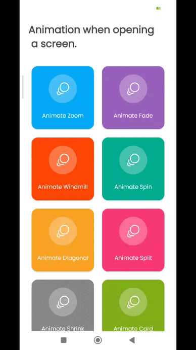
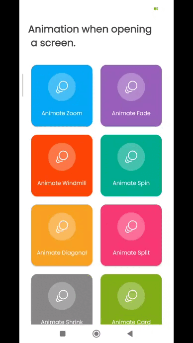
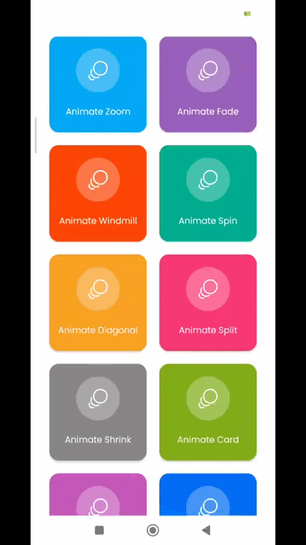
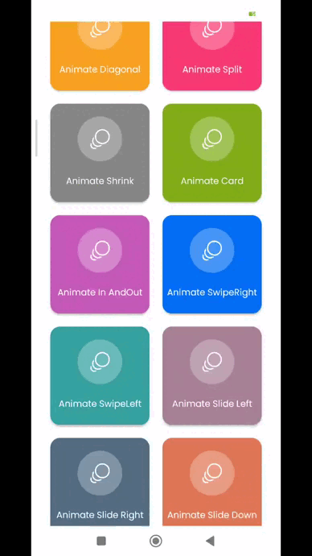
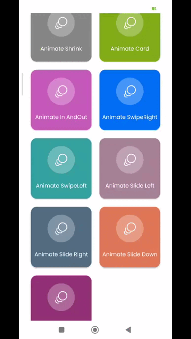
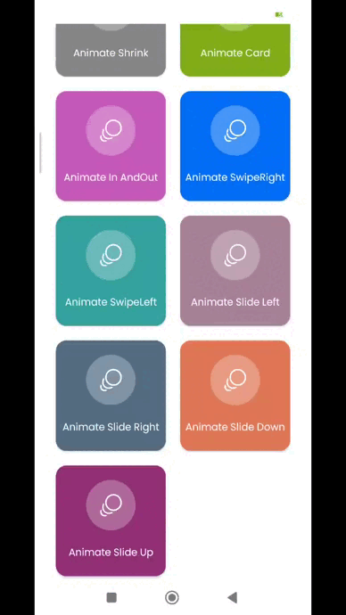
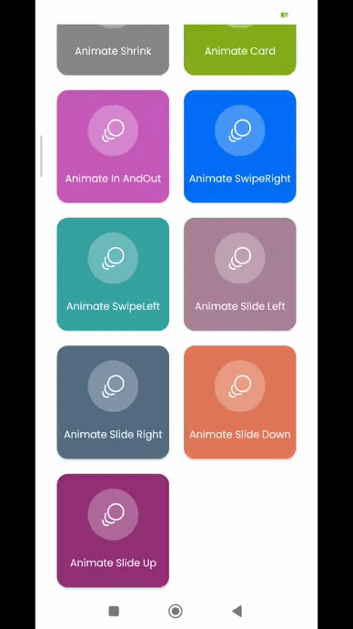

### Animation when opening a screen.

Some of the different ways to open the screen with animation.

#### Screenshots 📷
<table>
    <tr align="center">
      <th>Animation name</th>
      <th>Animation preview </th>
    </tr>
    </tr>
     <tr align="center">
      <td>Animate Windmill </td>
     <td></td>
    </tr>
     <tr align="center">
      <td>Animate Fade </td>
     <td></td>
    </tr>

 </tr>
     <tr align="center">
      <td>Animate Spin </td>
     <td></td>
    </tr>
</tr>
<tr align="center">
      <td>Animate Zoom</td>
     <td></td>
    </tr>
<tr align="center">
      <td>Animate Split </td>
     <td></td>
    </tr>
<tr align="center">
<td>Animate Shrink </td>
     <td></td>
</tr>
<tr align="center">
      <td>Animate Diagonal </td>
     <td></td>
</tr>
<tr align="center">
      <td>Animate Card </td>
     <td></td>
</tr>
<tr align="center">
      <td>Animate In And Out </td>
     <td></td>
</tr>
<tr align="center">
      <td>Animate Swipe Right </td>
     <td></td>
</tr>
<tr align="center">
      <td>Animate Swipe Left </td>
     <td></td>
</tr>
<tr align="center">
      <td>Animate Slide Left </td>
     <td></td>
</tr>
<tr align="center">
<td>Animate Slide Right </td>
     <td></td>
</tr>
<tr align="center">
  <td>Animate Slide Down </td>
     <td></td>
    </tr>
    <tr align="center">
<td>Animate Slide Up </td>
     <td></td>
</tr>
  </table>
